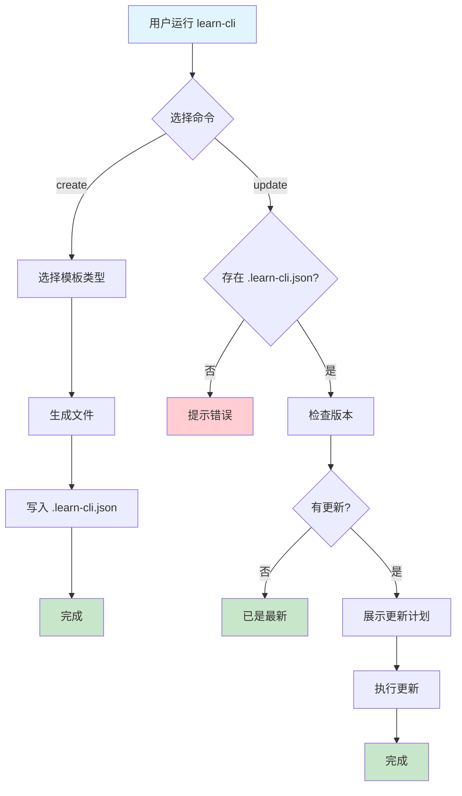

# Learn CLI

一个用于学习 CLI 工具开发的脚手架项目，支持创建和**升级**不同类型的 JavaScript/Node.js 模板。

## 目录

- [功能特性](#功能特性)
- [快速开始](#快速开始)
- [命令详解](#命令详解)
- [模板说明](#模板说明)
- [项目结构](#项目结构)
- [开发指南](#开发指南)
- [工作流程](#工作流程)
- [技术栈](#技术栈)
- [脚手架知识扩展](#脚手架知识扩展)

## 功能特性

- 🚀 快速创建 JavaScript/Node.js 项目模板
- 🔄 **模板版本管理与增量升级** — 创建的项目可检测并更新到最新模板版本
- 📝 支持多种模板类型（基础 JS、Node 模块、CLI 工具）
- 🔍 **智能差异对比** — 检测用户是否修改过文件，提供 diff 查看
- 🎨 美观的命令行界面和进度指示
- ⚡ 支持文件覆盖保护
- 🔧 基于 Commander.js 的完整 CLI 解决方案

## 快速开始

### 安装

```bash
# 全局安装
npm install -g .
# 或使用 pnpm
pnpm install -g .
```

### 本地开发

```bash
# 安装依赖
pnpm install

# 运行
node bin/index.js
```

### 基本使用

```bash
# 创建项目
learn-cli create

# 升级项目
learn-cli update
```

## 命令详解

### create — 创建项目

交互式创建新项目，支持选择模板类型。

```bash
learn-cli create          # 交互式创建
learn-cli init            # 别名
learn-cli create -f       # 强制覆盖已存在的文件
```

创建完成后会生成：
- 模板文件（根据选择的模板类型）
- `.learn-cli.json` 元信息文件（记录模板名、版本号，用于后续升级）

### update — 升级项目

将已创建的项目升级到最新模板版本。

```bash
learn-cli update          # 交互式升级
learn-cli update --check  # 仅检查是否有更新
learn-cli update -f       # 强制跳过确认
```

> ⚠️ 需要在由 `learn-cli create` 生成的项目目录中运行

#### 升级流程

```
1. 读取 .learn-cli.json 获取当前版本
      ↓
2. 对比模板注册表，检查是否有新版本
      ↓
3. 展示 changelog + 更新计划
      ↓
4. 遍历变更文件：
   • 新增文件 → 直接创建
   • 变更文件（未修改）→ 直接覆盖
   • 变更文件（已修改）→ 交互选择：覆盖/保留/查看diff
      ↓
5. 更新 .learn-cli.json 版本号
```

## 模板说明

| 模板          | 版本   | 说明                                             |
| ------------- | ------ | ------------------------------------------------ |
| `basic-js`    | v1.2.0 | 基础 JavaScript 模板，含 JSDoc、工具函数、ESLint |
| `node-module` | v1.1.0 | Node.js 模块模板，继承 EventEmitter              |
| `cli-tool`    | v1.1.0 | CLI 工具模板，集成 commander.js                  |

每个模板维护多版本历史，支持跨版本增量升级（如 v1.0.0 → v1.2.0）。

## 项目结构

```
learn-cli/
├── bin/
│   └── index.js              # CLI 入口
├── scripts/
│   ├── create.js             # create 命令
│   ├── update.js             # update 命令
│   └── templates/
│       └── versions.js       # 模板版本注册中心
├── package.json
└── README.md
```

### 生成项目示例

```
my-project/
├── output.js                  # 主文件
├── utils.js                   # 工具函数（v1.1.0 新增）
├── .eslintrc.cjs              # ESLint 配置（v1.2.0 新增）
└── .learn-cli.json            # 元信息
```

## 开发指南

### 添加新模板

编辑 `scripts/templates/versions.js`：

```js
"my-template": {
  latest: "1.0.0",
  versions: {
    "1.0.0": {
      files: {
        "index.js": `// 模板内容...`,
      },
      changelog: "- 初始版本",
    },
  },
},
```

然后在 `scripts/create.js` 的 inquirer choices 中加入模板名称。

### 常用命令

```bash
# 安装依赖
pnpm install

# 添加依赖
pnpm add <package-name>

# 运行测试
npm test
```

## 工作流程



## 技术栈

| 库           | 用途             |
| ------------ | ---------------- |
| Commander.js | 命令行界面框架   |
| Chalk        | 终端字符串样式   |
| Inquirer.js  | 交互式命令行     |
| Ora          | 终端进度指示器   |
| fs-extra     | 增强文件系统操作 |

## 脚手架知识扩展

### 常见用途

| 类别       | 场景示例                                     |
| ---------- | -------------------------------------------- |
| 项目初始化 | create-vite、create-react-app、Vue CLI       |
| 代码生成   | 组件/页面/Store/API 接口自动生成             |
| 开发效率   | 代码片段、批量重命名、依赖分析、环境切换     |
| 项目维护   | 版本升级、代码迁移、配置同步、健康检查       |
| 团队协作   | Git 规范、分支管理、Changelog 生成、发布流程 |

### 开发注意事项

#### 用户体验

- 提供清晰的 `--help` 和错误提示
- 支持命令别名简化输入
- 长时间操作显示进度反馈

#### 兼容性

- 检查 Node.js 版本
- 使用 `path.join()` 处理跨平台路径
- 网络请求添加超时和重试机制

#### 安全性

- 校验用户输入（项目名、路径等）
- 不在日志中输出敏感信息
- 定期检查依赖安全漏洞

#### 性能

- 并行处理独立任务
- 缓存模板避免重复下载
- 懒加载大型依赖

#### 可维护性

- 编写单元测试和集成测试
- 支持 `--debug` 调试模式
- 完善文档（README、CHANGELOG）

### 开发自查清单

```
□ 用户交互
  □ 命令行参数解析
  □ 交互式问答
  □ 进度反馈
  □ 友好的错误提示

□ 兼容性
  □ Node.js 版本检查
  □ 跨平台路径处理
  □ 网络容错

□ 安全性
  □ 输入校验
  □ 敏感信息保护
  □ 依赖安全审计

□ 性能
  □ 并行处理
  □ 缓存机制
  □ 懒加载

□ 可维护性
  □ 单元测试
  □ 调试模式
  □ 版本管理
  □ 文档完善
```
